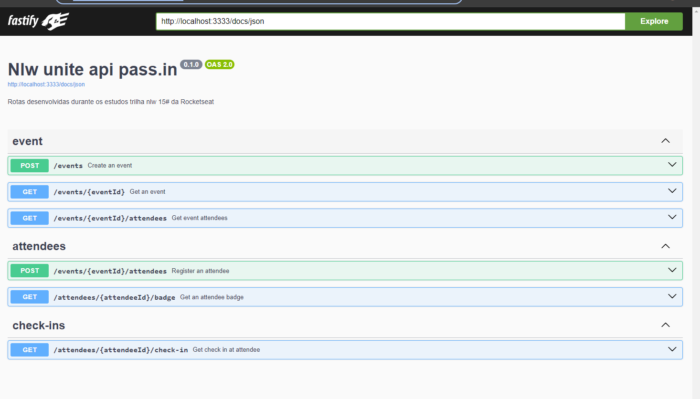

#  Api pass.in NLW unite

[](https://github.com/alexsandroferreira/nlw-unite-nodejs/releases)


O pass.in é uma aplicação de **gestão de participantes em eventos presenciais**. 

A ferramenta permite que o organizador cadastre um evento e abra uma página pública de inscrição.

Os participantes inscritos podem emitir uma credencial para check-in no dia do evento.

O sistema fará um scan da credencial do participante para permitir a entrada no evento.

Alem das rotas desenvolvidas na trilha, adicionei algumas configurações pessoais.

- Integração contínua para automatização do changelog.
- Lint seguindo o guia de estilo da rocketseat/node.
- Automação através do Husky:
    - Script de lint para correção de erros.
    - Script de verificação de commits usando o formato convencional.
- Plugin de lint para organização dos imports.


## Tabela de Conteúdos

- [Tecnologias](#tecnologias)
- [Instalação e Configuração](#instala%C3%A7%C3%A3o-e-configura%C3%A7%C3%A3o)
  - [Requisitos](#requisitos)
  - [Instalação](#instala%C3%A7%C3%A3o)
- [Licença](#licen%C3%A7a)

## Tecnologias 🛠️

Este projeto foi construído com as seguintes tecnologias:

- [Node.js »](https://nodejs.org)
- [Fastify »](https://fastify.dev/)
- [Typescript »](https://www.typescriptlang.org)
- [Zod »](https://zod.dev/)
- [@fatify-type-provider-zod »](https://github.com/turkerdev/fastify-type-provider-zod)
- [@fatify-sweagger »](https://github.com/fastify/fastify-swagger)
- [@fatify-sweagger-ui »](https://github.com/fastify/fastify-swagger-ui)
- [Eslint »](https://eslint.org/docs/latest/)
- [Eslint »](https://github.com/lydell/eslint-plugin-simple-import-sort)
- [@eslint-plugin-simple-import-sort »](https://github.com/Rocketseat/eslint-config-rocketseat)
- [husky »](https://typicode.github.io/husky/)
- [Commitlint »](https://commitlint.js.org/)
- [release-it »](https://github.com/release-it/release-it)
- [extensão vs code rest client »](https://github.com/Huachao/vscode-restclient)

## Instalação e configuração

## Requisitos

- [Node.js »](https://nodejs.org/en/download) na sua versão LTS
- Adicionar extensão [rest client »](https://github.com/Huachao/vscode-restclient), para realizar os testes de api dentro do projeto.
- Para permitir que o changelog rode automaticamente, verifique as configurações do repositório na aba Settings -> Actions -> General Workflow Permissions e marque a opção de permissões de leitura e escrita (Read and Write Permissions).

### Requisitos funcionais

- [x] O organizador deve poder cadastrar um novo evento;
- [x] O organizador deve poder visualizar dados de um evento;
- [x] O organizador deve poser visualizar a lista de participantes; 
- [x] O participante deve poder se inscrever em um evento;
- [x] O participante deve poder visualizar seu crachá de inscrição;
- [x] O participante deve poder realizar check-in no evento;

### Regras de negócio

- [x] O participante só pode se inscrever em um evento uma única vez;
- [x] O participante só pode se inscrever em eventos com vagas disponíveis;
- [x] O participante só pode realizar check-in em um evento uma única vez;

### Requisitos não-funcionais

- [x] O check-in no evento será realizado através de um QRCode;

### Instalação

1. Clone o projeto: `git clone https://github.com/alexsandroferreira/fastify-node-api-template.git`.
2. Instale as dependências: `npm install`.
3. Crie um arquivo `.env` e cole o conteúdo do `.env.example`. 
4. Para iniciar a aplicação execute `npm run build` e `npm run start`.
5. Popular o banco de dados `npm run prisma:seed`

## Documentação da API (Swagger)

Para documentação da API, acesse o link: http://localhost:3333/docs

<div align="center" id="short-description-swagger">

  <!-- Swagger -->
   


</div>

## Banco de dados

Nessa aplicação vamos utilizar banco de dados relacional (SQL). Para ambiente de desenvolvimento seguiremos com o SQLite pela facilidade do ambiente.

### Diagrama ERD


### Estrutura do banco (SQL)

```sql
-- CreateTable
CREATE TABLE "events" (
    "id" TEXT NOT NULL PRIMARY KEY,
    "title" TEXT NOT NULL,
    "details" TEXT,
    "slug" TEXT NOT NULL,
    "maximum_attendees" INTEGER
);

-- CreateTable
CREATE TABLE "attendees" (
    "id" INTEGER NOT NULL PRIMARY KEY AUTOINCREMENT,
    "name" TEXT NOT NULL,
    "email" TEXT NOT NULL,
    "event_id" TEXT NOT NULL,
    "created_at" DATETIME NOT NULL DEFAULT CURRENT_TIMESTAMP,
    CONSTRAINT "attendees_event_id_fkey" FOREIGN KEY ("event_id") REFERENCES "events" ("id") ON DELETE RESTRICT ON UPDATE CASCADE
);

-- CreateTable
CREATE TABLE "check_ins" (
    "id" INTEGER NOT NULL PRIMARY KEY AUTOINCREMENT,
    "created_at" DATETIME NOT NULL DEFAULT CURRENT_TIMESTAMP,
    "attendeeId" INTEGER NOT NULL,
    CONSTRAINT "check_ins_attendeeId_fkey" FOREIGN KEY ("attendeeId") REFERENCES "attendees" ("id") ON DELETE RESTRICT ON UPDATE CASCADE
);

-- CreateIndex
CREATE UNIQUE INDEX "events_slug_key" ON "events"("slug");

-- CreateIndex
CREATE UNIQUE INDEX "attendees_event_id_email_key" ON "attendees"("event_id", "email");

-- CreateIndex
CREATE UNIQUE INDEX "check_ins_attendeeId_key" ON "check_ins"("attendeeId");
```

## Licença

Projeto sob a licença [MIT »](/LICENSE)
